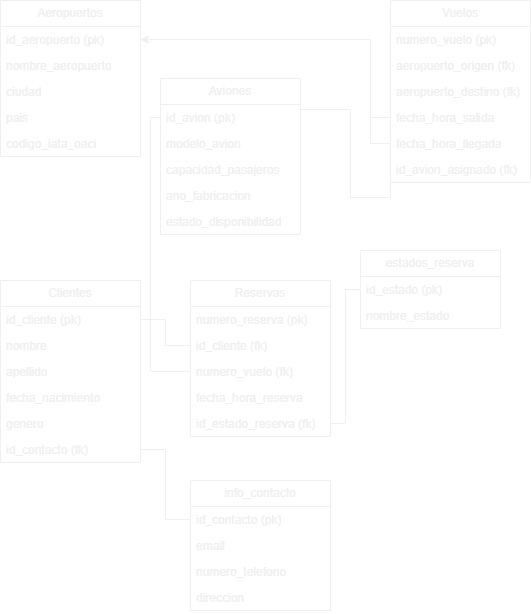

# Sistema de Reservas de Vuelos (Backend)

Bienvenido al repositorio del backend del Sistema de Reservas de Vuelos.
Este proyecto es la parte del servidor de la aplicación que gestiona la lógica de negocio y la base de datos.

## Descripción

Este repositorio contiene el código fuente y la lógica del backend del Sistema de Reservas de Vuelos. 
El backend proporciona servicios para buscar vuelos, realizar reservas, gestionar usuarios y cooperar con sistemas de aerolíneas.

### Características Principales

- Búsqueda y visualización de vuelos.
- Reserva de vuelos.
- Gestión de usuarios y perfiles.
- Integración con sistemas de aerolíneas.

### Tecnologías Utilizadas

- Java: Lenguaje de programación principal.
- Spring Boot: Marco de desarrollo de aplicaciones Java.
- Spring Data JPA: Facilita el acceso y la gestión de la capa de datos.
- MySQL: Sistema de gestión de Bases de Datos Relacional.
- Lombok: Librería que simplifica la creación de clases Java eliminando código repetitivo (como getters y setters).
- JUnit 5: Marco de prueba para Java.

## Documentación

Diagrama UML [db_project]

## Descripción

El diagrama UML db_project se ha creado para proporcionar una representación
visual de la estructura y las relaciones clave en mi proyecto. Este diagrama es una 
herramienta esencial para comprender la arquitectura y el diseño general
de la aplicación, lo que facilita la colaboración y el desarrollo eficiente.

### Propósito:

- Ayudar a los desarrolladores y colaboradores a comprender la estructura general de la aplicación.
- Identificar las clases clave y sus responsabilidades en el sistema.
- Ilustrar cómo interactúan las clases y cómo se comunican entre sí.
- Servir como referencia visual para la planificación y la toma de decisiones de diseño.

### Uso:

- Los desarrolladores nuevos pueden utilizar este diagrama como punto de partida para familiarizarse con la arquitectura del proyecto.
- Los miembros del equipo pueden consultar el diagrama para comprender las interacciones entre las clases durante el desarrollo y la depuración.
- Facilita la identificación de áreas que requieren modificaciones o mejoras en futuras versiones.

[@ 2023 Daniel Espinosa Gutiérrez / Makaia]